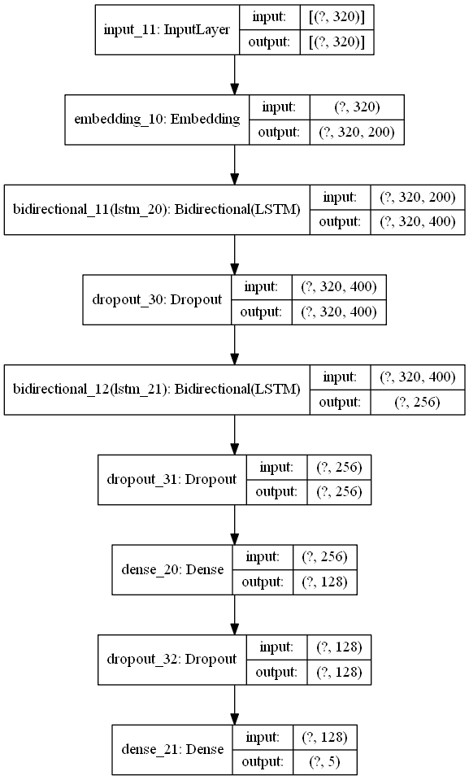
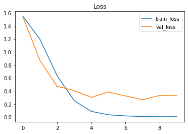
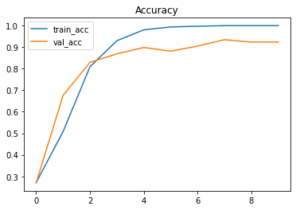
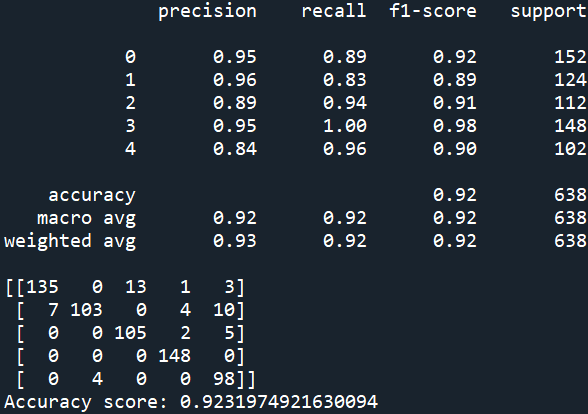
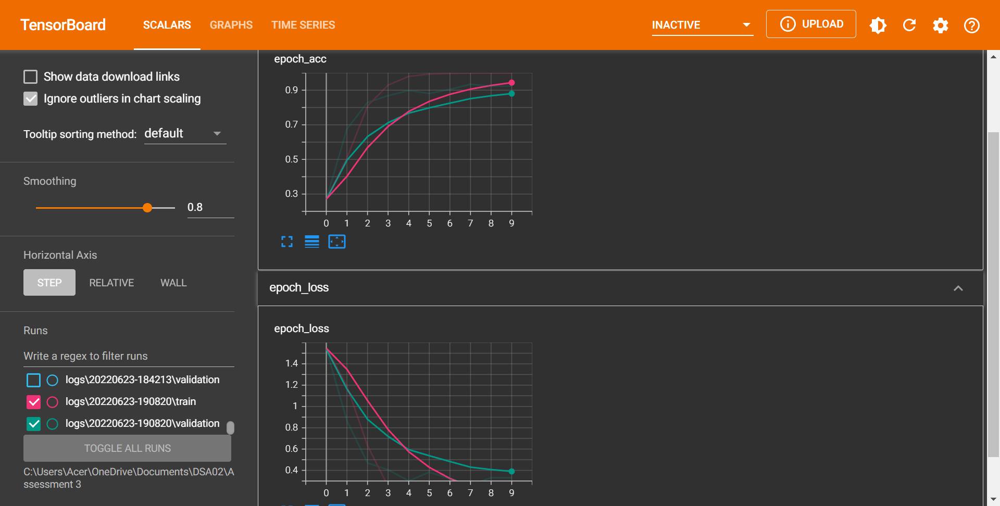

# Predictive classification model using Deep Learning Model of Bi-LSTM of Natural Language Processing (NLP) for BBC News Articles.
 Trained over 2,000 BBC News to categorize unseen articles into 5 categories namely Sport, Tech, Business, Entertainment and Politics.

## Description
1. The project's objective is to categorize the BBC News articles into 5 categories; Sport, Tech, Business, Entertainment and Politics. 
2. The articles contain enormous amount of data, which can be used to categorize the type of the articles. 
3. The dataset contains anomalies such as single letter (removed using RegEx), numbers, and 99 duplicates data.
4. The method used for the deep learning model are word embedding, LSTM and Bidirectional.
5. Several method can be used to improve the model such as lemmatization, stemming, CNN, n-grams, etc.

### Deep learning model images

## Results

### Training loss & Validation loss:

### Training accuracy & Validation accuracy:

### Model score:

## Discussion
1. The model achieved 92.8% accuracy score during model evaluation process. 
2. Recall and f1-score also reported a high percentage in range of 0.85 to 0.97 and 0.88 to 0.96 respectively. 
3. However, the model started to overfit after 2nd epochs based on the graph displayed on the Tensorboard.
4. To solve this problem, early stopping can be introduced to prevent overfitting and increasing the dropout data also can control the model from overfitting.

## Credits:
The source of the dataset is obtained from a github user @susanli2016. Check out the dataset by clicking the link below. :smile:
### Dataset link
[BBC News Text](https://github.com/susanli2016/PyCon-Canada-2019-NLP-Tutorial)
